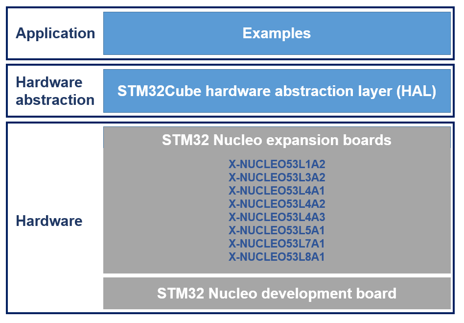

# X-CUBE-TOF1 Firmware Package

The X-CUBE-TOF1 is an expansion software package for STM32Cube. This software is gathering ranging sensor drivers for VL53L1CB, VL53L3CX, VL53L4CX, VL53L4CD, VL53L4ED, VL53L5CX, VL53L7CX and VL53L8CX running on STM32. It is built on top of STM32Cube software technology that ease portability across different STM32 microcontrollers.

**X-CUBE-TOF1 software features**:

- ranging sensor drivers for VL53L1CB, VL53L3CX, VL53L4CX, VL53L4CD, VL53L4ED, VL53L5CX, VL53L7CX and VL53L8CX running on STM32.
- Easy portability across different MCU families thanks to STM32Cube.
- Sample applications that the developer can use to start experimenting with the code.
- Examples implementation available for X-NUCLEO-53L1A2, X-NUCLEO-53L3A2, X-NUCLEO-53L4A2, X-NUCLEO-53L4A3, X-NUCLEO-53L4A1, X-NUCLEO-53L5A1, X-NUCLEO-53L7A1 , X-NUCLEO-53L8A1 STM32 expansion boards plugged on top of one NUCLEO-F401RE or NUCLEO-L476RG

The figure below shows the overall architecture.

- The drivers abstract low level details of the hardware and allow the middleware software to provide time of flight sensor features in a hardware independent fashion.
- The applications provide examples of how to use the code.

**Related information and documentation**:

- [DM00779301](https://www.st.com/content/ccc/resource/technical/document/data_brief/group3/88/e9/90/d2/a4/29/4b/98/DM00779301/files/DM00779301.pdf/jcr:content/translations/en.DM00779301.pdf): Time-of-Flight sensors software expansion for STM32Cube
- [STM32Cube](http://www.st.com/stm32cube)
- [STM32 Nucleo boards](http://www.st.com/stm32nucleo)
- [STM32 Nucleo expansion boards](http://www.st.com/x-nucleo)
